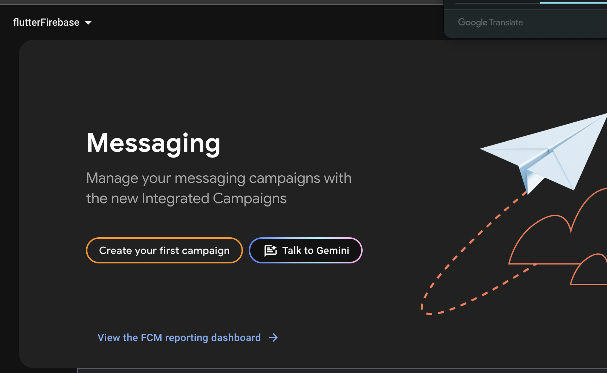
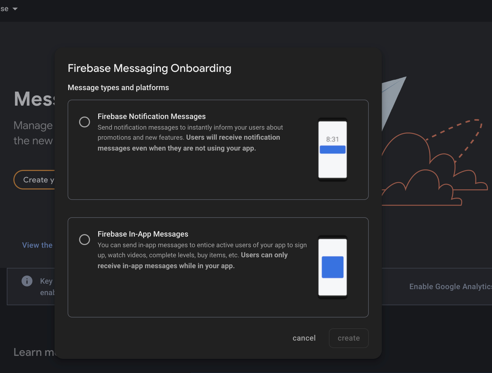
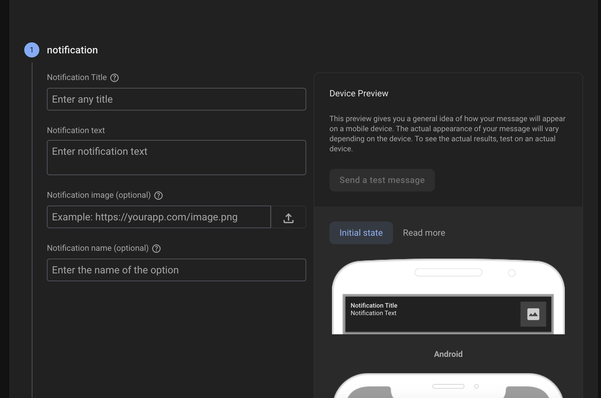
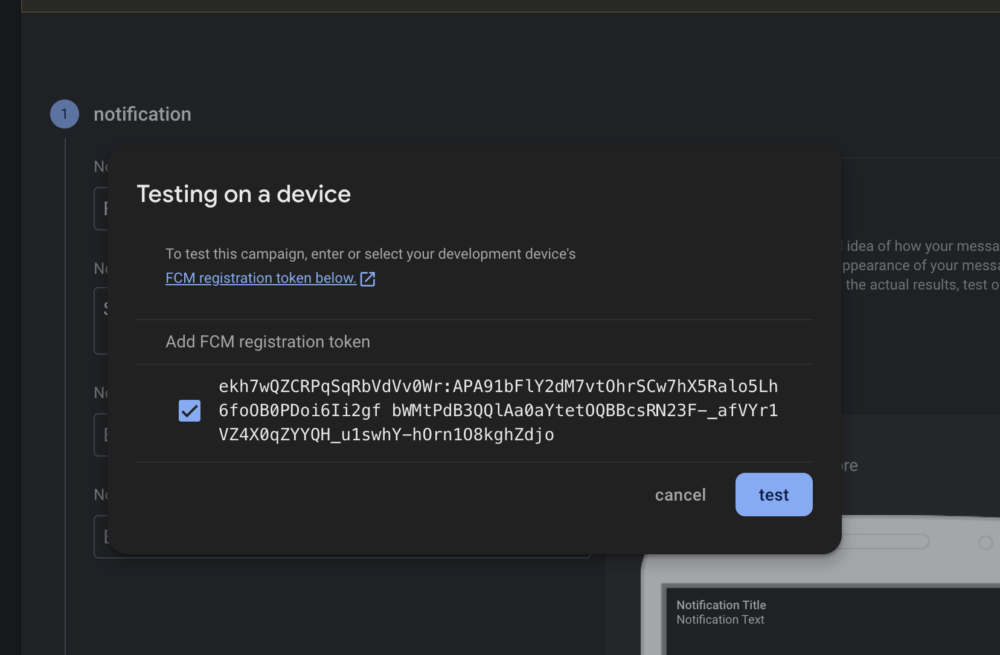
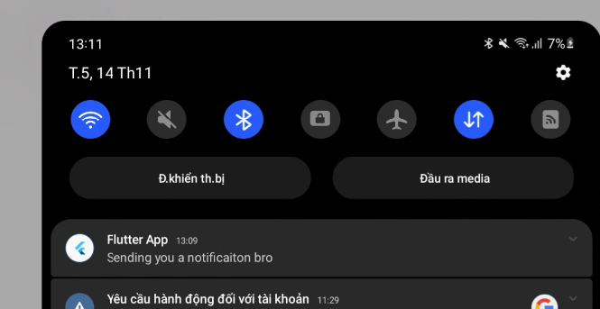

# flutter_notification_example

Project demo kết nối đến Firebase và làm việc với notification

## Hướng dẫn chi tiết
### 1. Kết nối Firebase
- Đầu tiên cần login vào firebase

```
firebase login
```

- Nếu nó trả về: 
```
Already logged in as example@gmail.com
```
tức là đã login thành công.

- Tiếp theo hãy sử dụng lệnh:

```
dart pub global activate flutterfire_cli
```
để cài đặt công cụ FlutterFire CLI trên toàn hệ thống (global).

- Nếu có thông báo: 
```
Built flutterfire_cli:flutterfire.
Installed executable flutterfire.
Warning: Pub installs executables into $HOME/.pub-cache/bin, which is not on your path.
You can fix that by adding this to your shell's config file (.zshrc, .bashrc, .bash_profile, etc.):

  export PATH="$PATH":"$HOME/.pub-cache/bin"

Activated flutterfire_cli 1.0.0.
```

thì ta sẽ sử dụng tiếp lệnh: 
```
export PATH="$PATH":"$HOME/.pub-cache/bin"
```

như nó đã cảnh báo.

- Chạy lệnh sau để khởi tạo Firebase trong ứng dụng Flutter:
```
flutterfire configure
```

sau khi chạy nó sẽ có dạng kiểu: 
```
i Found 2 Firebase projects.                                                                                                                                                                               
? Select a Firebase project to configure your Flutter application with ›                                                                                                                                   
❯ dev-vunt (vunt)                                                                                                                                                                                          
  flutterfirebase-f6cce (flutterFirebase)                                                                                                                                                                  
  <create a new project>  
```

hãy di chuyển đến dự án mà bạn muốn kết nối đến. Ở đây mình sẽ chuyển xuống `flutterfirebase-f6cce (flutterFirebase)` và bấm Enter.

Tiếp đến sẽ hiển thị:
```
i Found 2 Firebase projects.                                                                                                                                                                               
✔ Select a Firebase project to configure your Flutter application with · flutterfirebase-f6cce (flutterFirebase)                                                                                           
? Which platforms should your configuration support (use arrow keys & space to select)? ›                                                                                                                  
✔ android                                                                                                                                                                                                  
✔ ios                                                                                                                                                                                                      
✔ macos                                                                                                                                                                                                    
✔ web                                                                                                                                                                                                      
✔ windows
```

Bây giờ mình cần cấu hình cho `Android` nên sẽ di chuyển và lựa chọn android

```
? Which Android application id (or package name) do you want to use for this configuration, e.g. 'com.example.app'? › 
```

tiếp đến sẽ điền `com.example.flutterfirebase` và bấm `Enter`

Nếu thành công:

```

Firebase configuration file lib/firebase_options.dart generated successfully with the following Firebase apps:

Platform  Firebase App Id
android   1:473712729503:android:13935b6d102fdfa588b1aabbcc
```


- Tiếp đến cần thêm thư viện cho flutter:
```
flutter pub add firebase_core
```
```
flutter pub add firebase_messaging
```

- Trong main.dart, tại func main cần thêm

```dart
void main() async {
  WidgetsFlutterBinding.ensureInitialized();
  await Firebase.initializeApp(options: DefaultFirebaseOptions.currentPlatform);
  runApp(const MyApp());
}
```

### 2. Thêm FirebaseApi

- Tạo firebase messaging instance

```dart
class FirebaseApi {
  final _firebaseMessaging = FirebaseMessaging.instance;
}
```
- Tạo func để khởi tạo notifications

```dart
  Future<void> initNotification() async {
    await _firebaseMessaging.requestPermission();

    final fCMToken = await _firebaseMessaging.getToken();

    if (kDebugMode) {
      print("Firebase Token: $fCMToken");
    }
  }
```

và gọi hàm này trong func main: 
```dart
void main() async {
  WidgetsFlutterBinding.ensureInitialized();
  await Firebase.initializeApp(options: DefaultFirebaseOptions.currentPlatform);
  await FirebaseApi().initNotification();
  runApp(const MyApp());
}
```

lúc này khi khởi tạo xong ta sẽ log được ra Firebase Token:
```
Firebase Token:

ekh7wQZCRPqSqRbVdVv0Wr:APA91bFlY2dM7vtOhrSCw7hX5Ralo5Lh6foOB0PDoi6Ii2gfbWMtPdB3QQlAa0aYtetOQBBcsRN23F-_afVYr1VZ4X0qZYYQH_u1swhY-hOrn1O8kghZdjo
```

- Bây giờ mở firebase console và chọn messaging


- Lựa chọn `Create your first campaign`
Lúc này sẽ hiển thị dialog


Lựa chọn Firebase Notification Messages.

Bây giờ cần điền thông tin:



Sau khi điền xong lựa chọn test on a device và add token vừa lấy được vào



sau đó bấm  `test`

nếu đang ở ngoài app, sẽ có thông báo từ console log

```
D/FLTFireMsgReceiver(22312): broadcast received for message
W/FLTFireMsgService(22312): A background message could not be handled in Dart as no onBackgroundMessage handler has been registered.
W/FirebaseMessaging(22312): Unable to log event: analytics library is missing
W/FirebaseMessaging(22312): Missing Default Notification Channel metadata in AndroidManifest. Default value will be used.
```

và trên đt của bạn sẽ hiển thị thông báo push notification




